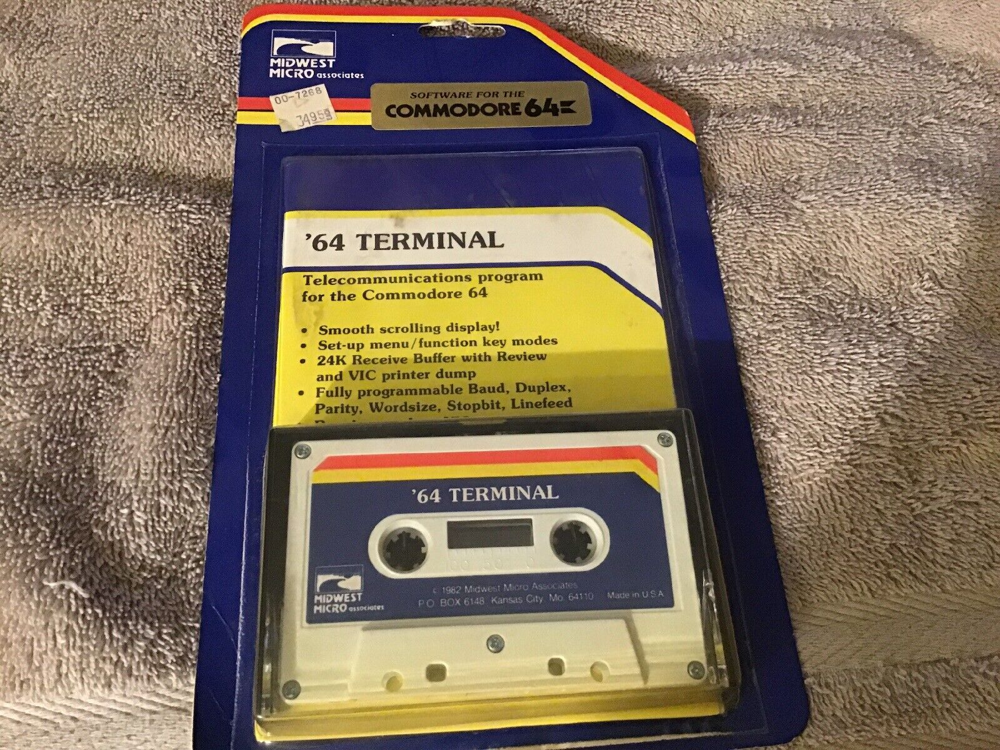
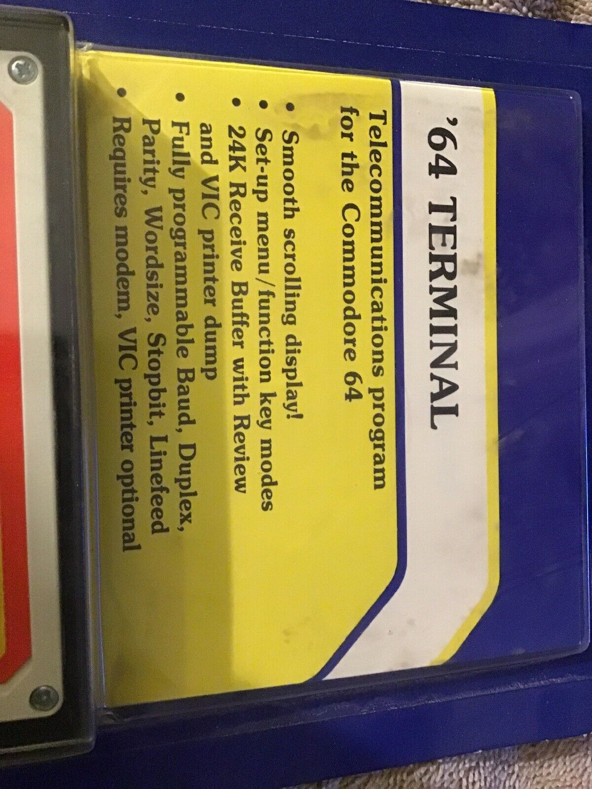
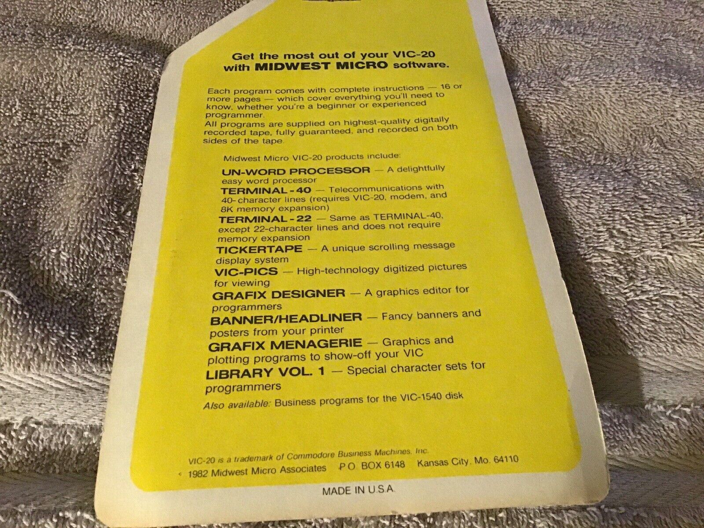

## '64 Terminal - Telecommunications program for the Commodore 64
> Mike Murphy (mike@emu7800.net)
>
In the early 1980s, my first terminal program was **'64 Terminal** for use with the
[VICMODEM](https://www.oldcomputr.com/commodore-vicmodem-1982/)
for dialing BBS systems and a service called
[CompuServe](https://www.compuserve.com).
The original program was written by Jim Rothwell at Midwest Micro Inc., circa 1983:

Eventually, much better freely available terminal programs became available, so I moved on. Nevertheless, the smooth scrolling feature was always fascinating and I could never figure out
how it was done.

I have long had the original cassette but could never find the executable online.
So forty years later, I figured I probably should reverse engineer this and finally solve the
smooth scrolling mystery. And perhaps, others might have interest as well.

Enjoy! Feel free to drop me a line. It would be interesting if this resonates with anybody. :)

### Contents

`64-t.s` is the assembly source listing reversed engineered from the original binary found on the cassette tape. It can be assembled by the [cc65](https://cc65.github.io/)
toolchain and outputs the exact bytes as the original.

`64-tng.s` is the assembly source listing of a "next generation" or improved/improving version
of the original `64-t.s`, eliminating minor bugs of the original and adding new features.
Still a work in progress.

Pre-assembled targets are included for convenience: `64-t.prg` and `64-tng.prg`.
Running `make` without arguments will build the targets from the source,
requiring Linux with cc65 built and located at $CC65_HOME and available in the $PATH along with GNU make.

To run on your Commodore 64, simply enter `LOAD"64-t.prg",8` or `LOAD"64-tng.prg",8`
at the `READY` prompt.
After loading completes, enter `RUN`.

### TODO

The "Next Generation" version is still a work in progress.

- weird issue where incoming characters are printed one per line
- scroll effect needs to retain PETSCII colors
- test the newmodem routines (secret tv options 3 and 4)
- PETSCII art seems to trigger an extra newline
